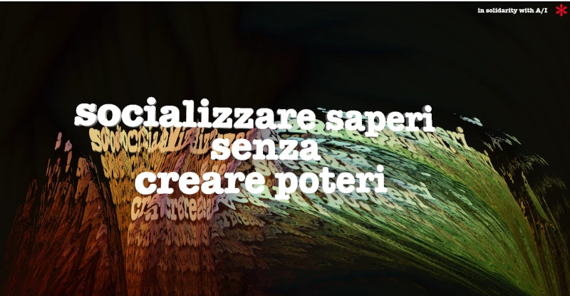
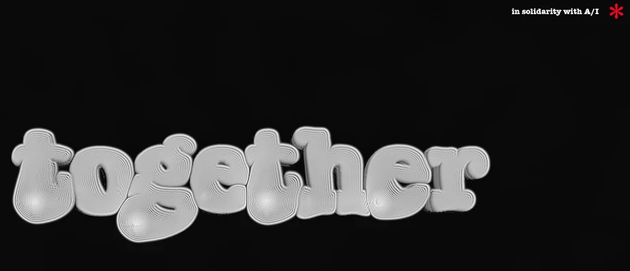
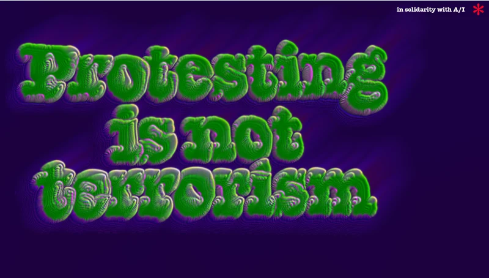

# In solidarity with the Autistici/Inventati collective

This repository contains some HTML to show solidarity to the A/I crew.

## Background

[Read the full story on the A/I website](https://www.inventati.org/)

On August 26, 2026, the U.S. Department of the Treasury [designated](href="https://home.treasury.gov/news/press-releases/sb0616/") the italian collective [Autistici/Inventati](git@github.com:iocose/solidarity-with-autistici-inventati.git) as a Specially Designated Global Terrorist (SDGT). This means that A/I is under an existential threat, as it will become more and more difficult for them to keep their servers running.

A/I is a non-profit association that since 2001 offers emails, websites, blogs, mailing lists, newsletters, irc, jabber.

They believe that communication must be free - and for free - and, therefore, universally accessible.To use their services you have to share their principles of anti-fascism, anti-racism, anti-sexism, anti-homophobia, anti-transphobia, and anti-militarism.

*We stand with the A/I crew* and their fight for freedom of expression, freedom of information, equality and inclusion.

## How to contribute

Make a new folder with an index.html page inside, put there all the images, javascript files and css that you need. Use relative links. If you prefer, you can also make an animated gif or a jpeg/webp/png image.

Give a significant name to that folder, open a pull request.

## Show solidarity to the A/I collective!

To share one of these folder on your website, download this repository, chose a folder and place it in a subfolder of your website `mywebsite.com/i-stand-with-autistici`, or put it as a subdomain `support-ai.mywebsite.com`.

